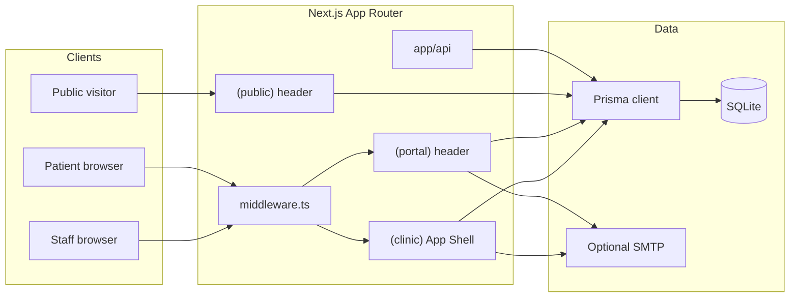
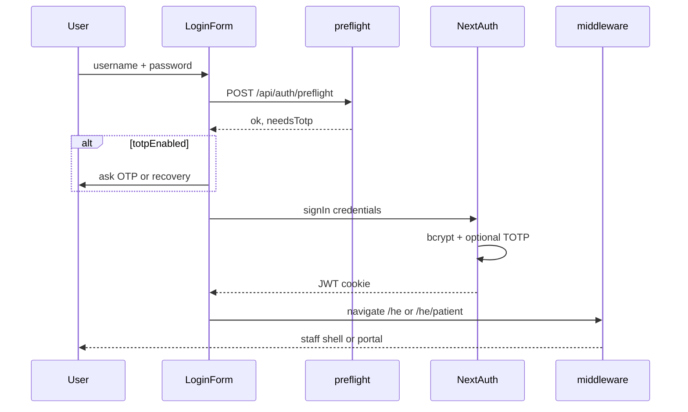

# Architecture

## Runtime

| Piece | Choice |
|-------|--------|
| Framework | Next.js **16.3** App Router, React **19**. `params` and `searchParams` are **Promises** — always `await` them |
| DB | SQLite file (`DATABASE_URL=file:./dev.db`) through Prisma 7 + `@prisma/adapter-libsql` |
| Auth | NextAuth v4 JWT + Credentials; optional TOTP (`otpauth` + `qrcode`) |
| i18n | Path locale `he` \| `en`. UI copy via `t()` in `src/lib/copy.ts`. `next-intl` plugin loads `src/messages/{locale}.json` (legacy catalog; new screens use `t()`) |
| CSS | Tailwind v4 (`src/app/globals.css` `@theme inline`). Brand teal `#134e4a` |

Root `/` ([`src/app/page.tsx`](../src/app/page.tsx)) redirects to `/he`. Locale `dir`/`lang` on `<html>` come from the `x-locale` request header set in [`middleware.ts`](../middleware.ts).

## Route groups

All product pages live under `src/app/[locale]/`.

| Group | Layout | Who |
|-------|--------|-----|
| `(clinic)` | [`AppShell`](../src/components/app-shell.tsx) | Staff. Redirects unauthenticated users to login; `PATIENT` → `/patient` |
| `(portal)` | Portal header + footer | `PATIENT` only. Staff → dashboard |
| `(public)` | Public header (logo, contact, כניסה) | Login, contact, book, accessibility |

Middleware duplicates the role split so deep links cannot skip the layout guards. Public contact, book, and accessibility are not staff prefixes, so they pass through without a session.

Locale is also forwarded as `x-locale` so the root layout can set `<html lang dir>` (Next.js allows a single root `<html>`).

## Server vs client

- **Server Components** load Prisma in `src/lib/*-service.ts` and render pages.
- **Server Actions** live next to routes (`patients/actions.ts`, `groups/actions.ts`, …) or in care/contact modules.
- **Client** pieces: login form, calendar (`ClinicCalendar`), TOTP setup, App Shell (pathname + mobile drawer), logout, locale toggle.

Calendar POSTs go to [`/api/calendar`](../src/app/api/calendar/route.ts) (`ajax=1` JSON or 303 redirect). Resource open/download: `/api/resources/[id]/open` and `.../download`.

## Domain services

Business rules stay in `src/lib`, not in Flask-style templates.

| Module | Responsibility |
|--------|----------------|
| `appointment-service.ts` | CRUD, range listing, recurrence expansion, vacancies, conflicts |
| `calendar-mutations.ts` | Form intents from the week grid (create, move, occupy, skip, publish link) |
| `patient-service.ts` | CRM list/filters, notes |
| `cancel-service.ts` | Portal cancel requests + reminder sends |
| `portal-service.ts` | Grant/reset portal user, temp password |
| `messaging-service.ts` | Direct messages and notifications |
| `group-service.ts` | Groups, sessions, attendance |
| `resource-service.ts` | Library + per-patient assignment |
| `treatment-plan-service.ts` | Plans, goals, share-with-patient |
| `assessment-service.ts` | PHQ-9 / GAD-7 persist + score |
| `assessment-catalog.ts` | Question text and severity bands |
| `contact-service.ts` | Public inquiries |
| `totp.ts` / `totp-service.ts` | Secrets, URI, verify, recovery hashes |
| `public-booking-service.ts` | Active booking tokens |
| `mail.ts` | Nodemailer or skip |
| `datetime.ts` | Clinic hours, `formatDateTime` (`he-IL` / `en-GB`, 24h) |
| `brand.ts` / `clinic-nav.ts` | Display name and staff nav |

`revalidateClinic()` busts dashboard/patient/calendar paths after mutations.

## Auth sequence

`UserRole`: `ADMIN`, `CLINICIAN` (staff shell), `PATIENT` (portal, `patientId` required).

## Data model (SQLite)

See [`prisma/schema.prisma`](../prisma/schema.prisma). Migrations under `prisma/migrations/`.

**Identity:** `User` (credentials, TOTP fields, optional `patientId`).

**Clinical:** `Patient`, `Appointment` (kind `APPOINTMENT` \| `VACANCY` \| `BLOCK`, optional weekly recurrence), `RecurrenceException`, `Note`, `TreatmentPlan` / `TreatmentPlanGoal`, `AssessmentType` / `Assessment`.

**Ops:** `CancelRequest`, `Message`, `Notification`, `TherapyGroup` + members/sessions/attendance, `Resource` / `PatientResource`, `PublicBookingLink`, `ContactInquiry`.

Recurring appointments store the series on one `Appointment` row (`isRecurring`, `recurrenceIntervalWeeks`, `recurrenceEndDate`). Listing expands occurrences in range; exceptions SKIP or MOVE a single start.

## i18n and RTL

- Default locale `he` ([`src/i18n/routing.ts`](../src/i18n/routing.ts)).
- New UI: `t(locale, "English", "עברית")` — gender-neutral UX Hebrew.
- `<html lang dir>` plus logical CSS (`start-0`, `ms-`, `border-inline-end`).
- RTL drawer: closed uses `-translate-x-full` / `rtl:translate-x-full`.
- Mix Hebrew + numbers/dates: wrap formatted timestamps in `dir="ltr"`.
- Inputs that may be Latin (email, phone, password, OTP) use `dir="ltr"` or `dir="auto"`.

Do not set `letter-spacing` on Hebrew text.

## Brand chrome

[`ClinicBrand`](../src/components/clinic-brand.tsx) loads `/logo.png`. Favicons: `public/favicon.ico`, `icon-192x192.png`, `icon-512x512.png`, `apple-touch-icon.png`. Metadata icons are declared in [`src/app/layout.tsx`](../src/app/layout.tsx).

Keep e2e hooks: `clinic-sidebar`, `login-form`, `logout`, `clinic-logo` (large login mark).

## Local development

Day-to-day: `npm run local` ([LOCAL-RUNNER.md](LOCAL-RUNNER.md)). That fast-forwards the current git branch, `npm install`s, runs `prisma migrate deploy`, seeds, and starts Next.js. Creating a new Prisma migration still uses `npm run db:migrate`.

## Testing layout

- Unit: `src/lib/*.test.ts` via Vitest (`npm test`).
- E2E: `e2e/*.spec.ts` — smoke (logo + CRM), calendar booking, portal ops, clinical/contact/2FA. Playwright `webServer` runs `npm run dev` on port 3000.
- Login helper [`e2e/auth.ts`](../e2e/auth.ts) retries until the NextAuth `session-token` cookie exists (first compile can complete UI login without persisting the cookie).

## Next.js 16 notes

Read `node_modules/next/dist/docs/` before changing framework usage. In this codebase:

- `params` / `searchParams` are Promises.
- `next/image` uses `preload` (not deprecated `priority`).
- Root layout is the only `<html>` / `<body>`.
- `AGENTS.md` / `CLAUDE.md` are regenerated by `next dev`; do not fight that block in diffs.
