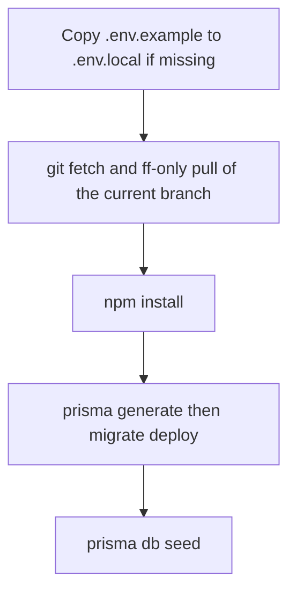

# Local runner

The local runner is [`scripts/local-run.sh`](../scripts/local-run.sh). It is the supported way to **apply repo updates and run the clinic app** on a laptop without remembering migrate/seed/install order.

Requires: `bash`, `git`, `npm`, Node 22 (same as CI).

## Daily use

```bash
npm run local
```

That is the default `up` command: update the checkout, then start Next.js on port 3000.

Open [http://localhost:3000/he/login](http://localhost:3000/he/login).

| Role | Username | Password |
|------|----------|----------|
| Staff | `admin` | `admin-password` |
| Portal | `portal` | `portal-password` |

## Commands

| npm script | Shell equivalent | Effect |
|------------|------------------|--------|
| `npm run local` | `bash scripts/local-run.sh` | `update` then `next dev` |
| `npm run local:update` | `bash scripts/local-run.sh update` | Pull, install, migrate, seed; **no** server |
| `npm run local:dev` | `bash scripts/local-run.sh dev` | Start Next.js only |
| `npm run local:check` | `bash scripts/local-run.sh check` | `npm test` + `npx next build` |
| `npm run local:e2e` | `bash scripts/local-run.sh e2e` | `update` then Playwright |
| `npm run local -- help` | `bash scripts/local-run.sh help` | Print usage |

Pass flags after `--` with npm:

```bash
npm run local -- --no-pull
npm run local:update -- --no-seed
npm run local -- --kill-port
PORT=3001 npm run local:dev
```

| Flag | Meaning |
|------|---------|
| `--no-pull` | Do not `git fetch` / `git pull` |
| `--no-seed` | Skip `npm run db:seed` |
| `--kill-port` | Stop whatever is listening on `PORT` (default 3000) before `next dev` |

After a fresh `git clone`, `bash scripts/local-run.sh` works even before you have run `npm install` (the script runs install itself).

## What `update` does, in order



1. **Env** — If `.env.local` is missing, copy `.env.example`. Existing `.env.local` is never overwritten (SMTP secrets stay put).
2. **Git** — Fast-forward `origin/<current-branch>` only. Skipped when the working tree is dirty, HEAD is detached, fetch fails, or `--no-pull` is set.
3. **npm** — `npm install` at the repo root.
4. **Database** — `npx prisma generate` then `npx prisma migrate deploy` (same non-interactive path as GitHub Actions). This **applies** migrations from `prisma/migrations/`; it does not create new ones.
5. **Seed** — Idempotent: creates or **resets** `admin` (password from `ADMIN_PASSWORD`, 2FA off), upserts **Test Patient**, creates or resets portal user `portal` / `portal-password`, ensures PHQ-9 / GAD-7 types.

`up` then prints the login URLs and `exec`s `npm run dev -- --port $PORT`.

## Creating migrations vs applying them

| Intent | Command |
|--------|---------|
| Apply what is already in git (runner / CI) | `npm run local:update` → `prisma migrate deploy` |
| Author a **new** migration while changing `schema.prisma` | `npm run db:migrate` (`prisma migrate dev`) |

Do not use `migrate dev` in the runner: it can prompt for a migration name and is the wrong tool after a `git pull`.

## First clone vs later updates

**Clone**

```bash
git clone https://github.com/lioralo/nextjs-clinic.git
cd nextjs-clinic
bash scripts/local-run.sh
```

**Already cloned, just want latest `main`**

```bash
git checkout main
npm run local
```

If you have uncommitted files, the runner **will not pull**. Commit or stash, or run `git pull` yourself, then `npm run local -- --no-pull`.

## Debug

`npm run local:check` is the runner’s debug command: Vitest then `next build`. `npm run local:e2e` is the full browser path (starts its own `next dev` via Playwright unless port 3000 is already up).

| Symptom | Cause | Fix |
|---------|--------|-----|
| `warning: Working tree is dirty; skip git pull` | Uncommitted files | Stash/commit, or `--no-pull` after a manual pull |
| `git pull --ff-only failed` | Local branch diverged | `git status`; rebase or reset to origin only if you intend to drop local commits |
| `Port 3000 is already in use` | Leftover `next dev` | Stop it, or `npm run local -- --kill-port` |
| Login page loads, session bounce | `.env.local` `NEXTAUTH_SECRET` / `NEXTAUTH_URL` | Recreate from `.env.example` only if you have no custom secrets; use http://localhost:3000 |
| Empty CRM / missing admin / cannot log in | Seed skipped or different `DATABASE_URL` | `npm run db:seed` then restart; seed resets `admin` / `admin-password` |
| Prisma client missing after pull | Generate did not run | `npm run local:update` |
| `migrate deploy` errors on SQLite | DB from an older tree | Keep `dev.db` or delete it (loses local data) and re-run `local:update` |
| Windows `bash: command not found` | No Git Bash | Install Git for Windows and run from Git Bash, or WSL |

CI (`.github/workflows/test.yml`) does not call the runner; it repeats the same migrate deploy + seed + test + e2e steps so GitHub stays non-interactive.

## Related docs

- Product surfaces: [FEATURES.md](FEATURES.md)
- Stack and data: [ARCHITECTURE.md](ARCHITECTURE.md)
- Env vars, SMTP, general troubleshooting: [OPERATIONS.md](OPERATIONS.md)
